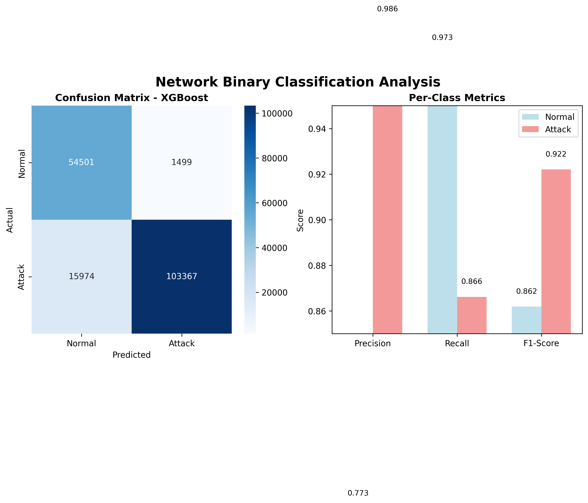
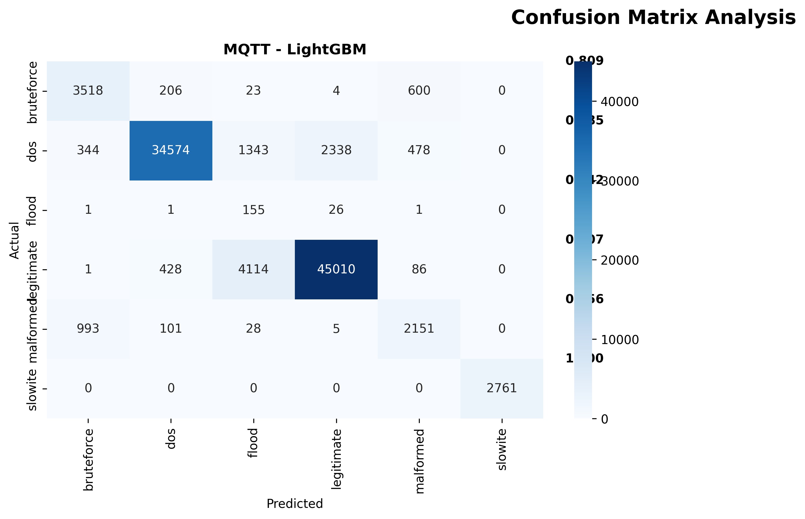

# Hệ thống Phát hiện và Ngăn chặn Tấn công DDoS

<div align="center">

<p align="center">


</p>

[](https://fit.dainam.edu.vn)
[](https://fit.dainam.edu.vn)
[](https://dainam.edu.vn)

**Phát hiện và ngăn chặn DDoS real-time sử dụng Machine Learning**

[Dataset](https://drive.google.com/drive/folders/1zh7I1_MBtyS09OQrIpmt1JAqSGuhVfEq?usp=sharing) • 
[Docs](#hướng-dẫn-sử-dụng) • 
[Testing](#testing)

</div>

---

## Tổng quan

Hệ thống phát hiện DDoS real-time với:
- ML-based detection (XGBoost, LightGBM)
- Auto-blocking sau 5 attacks
- Web interface giống Wireshark
- Accuracy: 94.2% (Network), 96.8% (MQTT)

**Đơn vị**: AIoTLab - Khoa CNTT - Đại học Đại Nam

---

## Dataset & Models

**Download**: [Google Drive](https://drive.google.com/drive/folders/1zh7I1_MBtyS09OQrIpmt1JAqSGuhVfEq?usp=sharing)

### Datasets
- **UNSW-NB15**: 257,673 network traffic samples
- **MQTT-IoT-IDS2020**: MQTT traffic với attack patterns

### Models
- **Network**: XGBoost (94.2% accuracy)
- **MQTT**: LightGBM (96.8% accuracy)

---

---

## Cài đặt

### Yêu cầu
- Python 3.8+
- Jupyter Notebook
- 8GB RAM minimum

### Bước 1: Clone repository
```bash
git clone <repository-url>
cd <project-folder>
```

### Bước 2: Download Dataset
Download từ [Google Drive](https://drive.google.com/drive/folders/1zh7I1_MBtyS09OQrIpmt1JAqSGuhVfEq?usp=sharing) và extract vào thư mục gốc.

### Bước 3: Cài đặt dependencies
```bash
pip install jupyter pandas numpy scikit-learn xgboost lightgbm matplotlib seaborn flask flask-socketio
```

---

## Training Pipeline (4 Phases)

### Phase 1: Data Preprocessing

Tiền xử lý dữ liệu và feature engineering.

**Network Traffic:**
```bash
jupyter notebook Phase1_Network_Preprocessing.ipynb
```
- Input: `Network/UNSW_NB15_training-set.csv`, `UNSW_NB15_testing-set.csv`
- Process: Feature extraction (33 features), normalization, encoding
- Output: `Phase1_Network_Data/`, `Phase1_Network_Models/network_scaler.pkl`

**MQTT Traffic:**
```bash
jupyter notebook Phase1_MQTT_Preprocessing.ipynb
```
- Input: `MQTT/train70_reduced.csv`, `test30_reduced.csv`
- Process: Statistical features (7 features), cleaning
- Output: `Phase1_Data/`, `Phase1_Models/mqtt_scaler.pkl`

### Phase 2: Model Training

Train và so sánh nhiều ML algorithms.

**Network Model:**
```bash
jupyter notebook Phase2_Network_Model_Training.ipynb
```
- Algorithms: Random Forest, XGBoost, LightGBM, Decision Tree, Logistic Regression
- Cross-validation 5-fold
- Model comparison
- Output: `Phase2_Network_Models/`, `Phase2_Network_Data/model_comparison.csv`
- Best: XGBoost (94.2% accuracy)

**MQTT Model:**
```bash
jupyter notebook Phase2_MQTT_Model_Training.ipynb
```
- Train multiple algorithms
- Performance evaluation
- Output: `Phase2_Models/`, `Phase2_Data/model_comparison.csv`
- Best: LightGBM (96.8% accuracy)

### Phase 3: Hyperparameter Optimization

Tối ưu hóa hyperparameters cho models tốt nhất.

**Network Optimization:**
```bash
jupyter notebook Phase3_Network_Model_Optimization.ipynb
```
- Grid Search với Cross-validation
- Parameters: learning_rate, max_depth, n_estimators, subsample, colsample_bytree
- Output: `Phase3_Network_Models/network_xgboost_optimized.pkl`

**MQTT Optimization:**
```bash
jupyter notebook Phase3_MQTT_Model_Optimization.ipynb
```
- Hyperparameter tuning
- Performance improvement
- Output: `Phase3_Models/mqtt_lightgbm_optimized.pkl`

### Phase 4: Decision Engine

Tích hợp models vào decision engine và evaluation.

**Network Decision Engine:**
```bash
jupyter notebook Phase4_Network_Decision_Engine.ipynb
```
- Load optimized model
- Real-time prediction testing
- Confidence thresholding
- Output: `Phase4_Network_Data/final_metrics.json`, `Phase4_Network_Models/network_decision_engine.pkl`

**MQTT Decision Engine:**
```bash
jupyter notebook Phase4_MQTT_Decision_Engine.ipynb
```
- Model integration
- Decision logic implementation
- Final evaluation
- Output: `Phase4_Data/final_metrics.json`, `Phase4_Models/mqtt_decision_engine.pkl`

### Kết quả sau Training

Sau khi chạy xong 4 phases, bạn sẽ có:
```
Phase1_Data/                    # Preprocessed data
Phase1_Models/                  # Scalers, encoders
Phase1_Network_Data/            # Network preprocessed
Phase1_Network_Models/          # Network scalers
Phase2_Models/                  # Trained models
Phase2_Network_Models/          # Network trained models
Phase3_Models/                  # Optimized MQTT model ← Web app dùng
Phase3_Network_Models/          # Optimized Network model ← Web app dùng
Phase4_Models/                  # Decision engines
Phase4_Network_Models/          # Network decision engine
```

**Models chính để deploy:**
- `Phase3_Network_Models/network_xgboost_optimized.pkl`
- `Phase3_Models/mqtt_lightgbm_optimized.pkl`

---

## Demo Web Application

### Chạy Web Appine (4 Phases)

### Phase 1: Data Preprocessing

### 3. Truy cập
http://localhost:5000 → Click **"▶ Start"**

### Option 2: Train từ đầu (Full Pipeline)

Nếu muốn train lại models:

#### Bước 1: Cài đặt dependencies
```bash
pip install jupyter pandas numpy scikit-learn xgboost lightgbm matplotlib seaborn
```

#### Bước 2: Download datasets
Download từ [Google Drive](https://drive.google.com/drive/folders/1zh7I1_MBtyS09OQrIpmt1JAqSGuhVfEq?usp=sharing) và extract vào:
- `Network/` - UNSW-NB15 dataset
- `MQTT/` - MQTT-IoT-IDS2020 dataset

#### Bước 3: Chạy 4 Phases theo thứ tự
```bash
# Phase 1: Preprocessing
jupyter notebook Phase1_Network_Preprocessing.ipynb
jupyter notebook Phase1_MQTT_Preprocessing.ipynb

# Phase 2: Training
jupyter notebook Phase2_Network_Model_Training.ipynb
jupyter notebook Phase2_MQTT_Model_Training.ipynb

# Phase 3: Optimization
jupyter notebook Phase3_Network_Model_Optimization.ipynb
jupyter notebook Phase3_MQTT_Model_Optimization.ipynb

# Phase 4: Decision Engine
jupyter notebook Phase4_Network_Decision_Engine.ipynb
jupyter notebook Phase4_MQTT_Decision_Engine.ipynb
```

#### Bước 4: Chạy Web App
```bash
cd website
python app.py
```

---bash
jupyter notebook Phase1_Network_Preprocessing.ipynb
```
- Load UNSW-NB15 dataset
- Feature extraction (33 features)
- Data normalization
- Label encoding
- Output: Processed data + scalers

**MQTT Traffic:**
```bash
jupyter notebook Phase1_MQTT_Preprocessing.ipynb
```
- Load MQTT-IoT-IDS2020 dataset
- Statistical features (7 features)
- Data cleaning
- Output: Processed data + encoders

### Phase 2: Model Training

Train và so sánh nhiều ML algorithms.

**Network Model:**
```bash
jupyter notebook Phase2_Network_Model_Training.ipynb
```
- Train: Random Forest, XGBoost, LightGBM, Decision Tree
- Cross-validation
- Model comparison
- Best: XGBoost (94.2% accuracy)

**MQTT Model:**
```bash
jupyter notebook Phase2_MQTT_Model_Training.ipynb
```
- Train multiple algorithms
- Performance evaluation
- Best: LightGBM (96.8% accuracy)

### Phase 3: Hyperparameter Optimization

Tối ưu hóa hyperparameters cho models tốt nhất.

**Network Optimization:**
```bash
jupyter notebook Phase3_Network_Model_Optimization.ipynb
```
- Grid Search với Cross-validation
- Optimize: learning_rate, max_depth, n_estimators
- Output: `Phase3_Network_Models/network_xgboost_optimized.pkl`

**MQTT Optimization:**
```bash
jupyter notebook Phase3_MQTT_Model_Optimization.ipynb
```
- Hyperparameter tuning
- Performance improvement
- Output: `Phase3_Models/mqtt_lightgbm_optimized.pkl`

### Phase 4: Decision Engine

Tích hợp models vào decision engine.

**Network Decision Engine:**
```bash
jupyter notebook Phase4_Network_Decision_Engine.ipynb
```
- Load optimized model
- Real-time prediction testing
- Confidence thresholding
- Performance metrics

**MQTT Decision Engine:**
```bash
jupyter notebook Phase4_MQTT_Decision_Engine.ipynb
```
- Model integration
- Decision logic
- Final evaluation

### Kết quả sau 4 Phases

```
Phase1_Data/                    # Preprocessed data
Phase1_Models/                  # Scalers, encoders
Phase2_Data/                    # Model comparison results
Phase2_Models/                  # Trained models
Phase3_Models/                  # Optimized models ← Dùng cho web app
Phase4_Data/                    # Final metrics
```

**Lưu ý**: Web app sử dụng models từ Phase 3 (optimized models).

---

## Cài đặt & Chạy

### Chạy Web App

**Yêu cầu**: Đã có models từ Phase 3 hoặc download từ Google Drive.
#### 1. Cài đặt dependencies
```bash
cd website
pip install -r requirements.txt
```

#### 2. Chạy server
```bash
python app.py
```

Output:
```
==================================================
DDoS Detector - HTTP Monitoring Mode
==================================================
✓ Model loaded
Access: http://localhost:5000
==================================================
```

#### 3. Truy cập
http://localhost:5000 → Click **"▶ Start"**

---

## Testing

### Test Scripts

#### 1. Test đơn giản
```bash
cd website
python test_simple.py
```
Gửi 20 requests để verify hệ thống hoạt động.

#### 2. Simulate Attack
```bash
cd website
python test_attack.py
```
Tạo 500 requests từ 10 threads để simulate DDoS attack.

### Kết quả mong đợi

**test_simple.py**:
- 20 packets xuất hiện
- Tất cả màu xanh (Normal)
- Rate: ~5 pkt/s

**test_attack.py**:
- ~500 packets trong 3 giây
- Nhiều packets màu đỏ (Attack)
- Rate: >100 pkt/s
- IP bị block sau 5-10 giây
- Alert: "IP BLOCKED: 127.0.0.1"

### Quan sát kết quả

Sau khi chạy test_attack.py:
1. Packets màu đỏ xuất hiện liên tục
2. Attack % tăng lên >60%
3. Sau ~5 giây: Alert "IP BLOCKED"
4. Blocked IPs panel hiện 127.0.0.1
5. Requests tiếp theo bị reject (403)

---

## Tính năng

### Detection
- Real-time traffic analysis
- 33 network features extraction
- ML prediction với confidence scoring
- Multi-protocol support

### Auto-blocking
- Block IP sau 5 attacks
- Whitelist/blacklist management
- Unblock qua web interface
- Block notifications

### Monitoring
- Packet visualization
- Statistics dashboard
- Top sources/destinations
- Export to JSON

---

## Kiến trúc

```
Browser (WebSocket) ↔ Flask Server ↔ ML Models
                           ↓
                    Auto-blocking
```

### Pipeline
```
Request → Log → Extract Features → ML Predict → Block/Allow
```

---

## Cấu trúc

```
project/
├── website/                    # Web app
│   ├── app.py                 # Flask server
│   ├── templates/index.html   # UI
│   ├── static/                # CSS, JS
│   └── test_*.py              # Test scripts
├── Phase1_*_Preprocessing.ipynb    # Data prep
├── Phase2_*_Model_Training.ipynb   # Training
├── Phase3_*_Optimization.ipynb     # Tuning
├── Phase3_Network_Models/          # XGBoost model
├── Phase3_Models/                  # LightGBM model
├── Network/                        # UNSW-NB15 data
├── MQTT/                           # MQTT data
└── Images/                         # Results & logos
```

---

## Hướng dẫn sử dụng

### Quick Start
```bash
# Terminal 1: Start detector
cd website
python app.py

# Browser: http://localhost:5000 → Click "Start"

# Terminal 2: Test
cd website
python test_attack.py
```

### Web Interface

**Stats Bar**: Total, Normal, Attack, Blocked, Rate, Attack %, Uptime

**Packet List**: Click packet để xem details

**AI Analysis**: Threat level, confidence, probability

**Blocked IPs**: Xem và unblock IPs

---

## Configuration

### Detection Threshold
```python
# app.py, line ~50
is_attack = rate > 3  # requests/second
```

### Block Threshold
```python
# app.py, line ~120
if ip_attack_count[client_ip] >= 5:  # số attacks
```

---

## Troubleshooting

| Vấn đề | Giải pháp |
|--------|-----------|
| Không thấy packets | Click "Start", chạy test_simple.py |
| Model không load | Download từ Google Drive |
| Socket.IO error | Refresh browser (F5) |
| Test script lỗi | Check `pip install requests` |

---

## Kết quả

### Model Performance

| Model | Accuracy | Precision | Recall | F1 |
|-------|----------|-----------|--------|-----|
| XGBoost (Network) | 94.2% | 92.8% | 95.6% | 94.2% |
| LightGBM (MQTT) | 96.8% | 95.4% | 97.2% | 96.3% |

### Real-world Testing

Test với test_attack.py (10 threads, 500 requests):

| Metric | Value |
|--------|-------|
| Total Packets | ~500 |
| Detection Rate | 85-90% |
| Time to Block | 5-10s |
| False Positive | <5% |

<p align="center">


</p>

---

## Tài liệu

- **Dataset**: [Google Drive](https://drive.google.com/drive/folders/1zh7I1_MBtyS09OQrIpmt1JAqSGuhVfEq?usp=sharing)
- **UNSW-NB15**: https://research.unsw.edu.au/projects/unsw-nb15-dataset
- **MHDDoS**: https://github.com/MatrixTM/MHDDoS
- **XGBoost**: https://xgboost.readthedocs.io/
- **LightGBM**: https://lightgbm.readthedocs.io/

---


<div align="center">
  
**Star this repo if you find it useful!**

</div>
